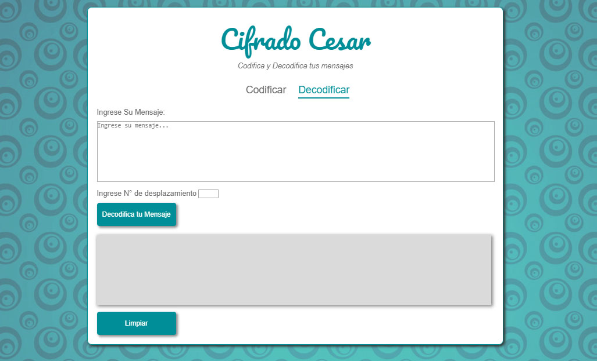
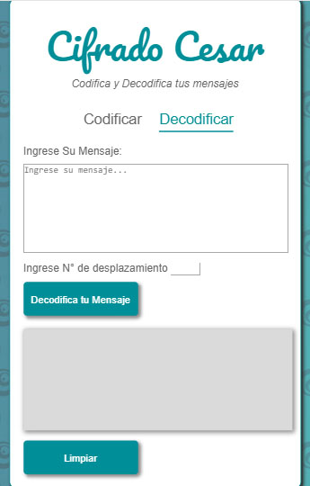

Cifrado Cesar es una app que permite cifrar y descifrar un mensaje con un numero de desplazamiento a elección.

## Tecnología usada

* HTML5
* CSS
* Javascript ECMA6

## Vistas

* versión desktop

* versión mobile

## Intrucciónes de uso

### Para Cifrar:

* ingresar texto a cifrar (no escribir Ñ, numeros ni signos de puntuación).

* elegir un offset de desplazamiento.

* oprime boton "codifica tu mensaje".

* recibe tu mensaje codificado.

* oprime boton "limpiar" para refrescar y volver a utilizar.

### Para Decifrar:

* ingresar texto a decifrar.

* elegir un offset de desplazamiento (el mismo que se utilizo para codificar).

* oprime boton "decodifica tu mensaje".

* recibe tu mensaje decodificado.

* oprime boton "limpiar" para refrescar y volver a utilizar.

## Enlace Deploy

https://valepm0511.github.io/Cifrado-Cesar/

